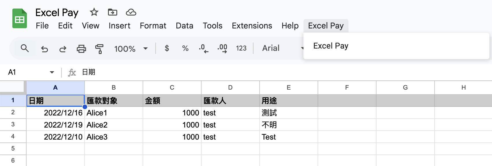
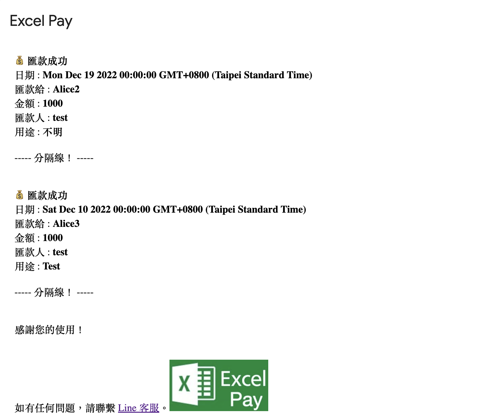

# Excel Pay Project

This project is a Google Apps Script designed to read payment data from a Google Sheet and generate a payment notification. It includes functionality to format the data and display it in a modal dialog within Google Sheets.

## Files

### 1. `excel-pay.js`

This file contains the main function `excelPay()` which:
- Reads data from the active Google Sheet.
- Validates the data for each row.
- Formats the valid data into a notification message.
- Displays the messages in a modal dialog.

#### Key Functions:
- `excelPay()`: Main function to process payment data.
- `onOpen()`: Creates a custom menu in Google Sheets to trigger the `excelPay()` function.

### 2. `image-data.js`

This file contains the `base64Image` variable which holds the Base64 encoded image data used in the payment notification. This helps keep the main code cleaner and separates the image data from the logic.

#### Key Variables:
- `base64Image`: A string containing the Base64 encoded image data.

## Usage

1. Open the Google Sheet where you want to use this script.
2. Go to `Extensions` > `Apps Script`.
3. Copy and paste the contents of `excel-pay.js` and `image-data.js` into the script editor.
4. Save the project.
5. Reload the Google Sheet to see the custom menu.
6. Click on the `Excel Pay` menu and select `Excel Pay` to run the script.

## License

This project is licensed under the MIT License - see the [LICENSE](LICENSE) file for details.
